                 ____    _   _     __  __           _   _ 
                | __ )  (_) | |_  |  \/  |   __ _  (_) | |
                |  _ \  | | | __| | |\/| |  / _` | | | | |
                | |_) | | | | |_  | |  | | | (_| | | | | |
                |____/  |_|  \__| |_|  |_|  \__,_| |_| |_|

                
                

###Download pre-built installer for windows
http://imharrywu.github.io/bitmail-qt/bitmail-intro.html

###Introduction
- Bitmail(比特信) is a simple chat client currently based on email exchange network, which is securely signed & encrypted with RSA certificate(openssl, https://github.com/openssl/openssl). 

- As you known that, Sending a message with your signature, will help your friend to understand that, this email is definitely sent from yourself, not any cracker.Sending a message by encrypted this message with your friend's certificate, will make sure that,this message is not viewed by anyone else.

- The network is now based on traditional mail exchange system(libcurl, https://github.com/bagder/curl), which has more delay than IM servers or IRC network, and in the future, the MX network will be replaced to other communication network. 

- Talking with your friends, is your right. no one can supervise it.
    
###Features
- secure & trust talking
- sign & verify utilities used to sign images, documents, and vote.
- reject any spam message away.
- invite friend(s) or accept friend(s) by exchange CertID.

###Snapshots
- Login with existed profile

- 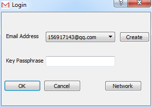 

- Create new profile

-  

- Network setup

- 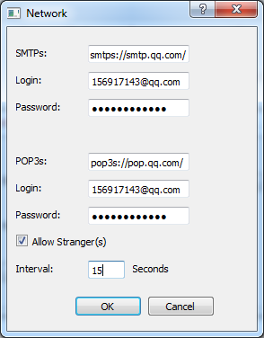 

- Main window

- 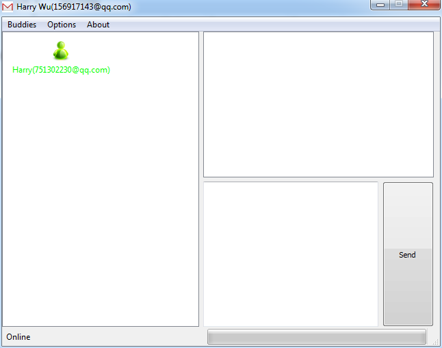 

- Add a new budy by sending request and wait for your friend's confirmation

- 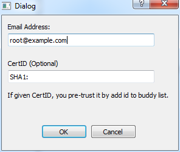 

- Add a new budy by pasting your buddy's certificate

- 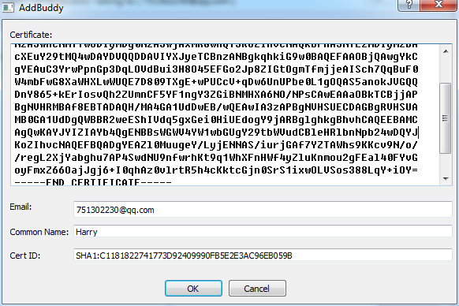 

- Confirm a new request.

- 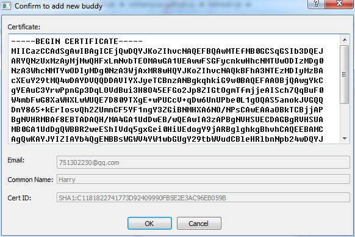 

- send a message to a selected buddy.

-  

- view all messages

- 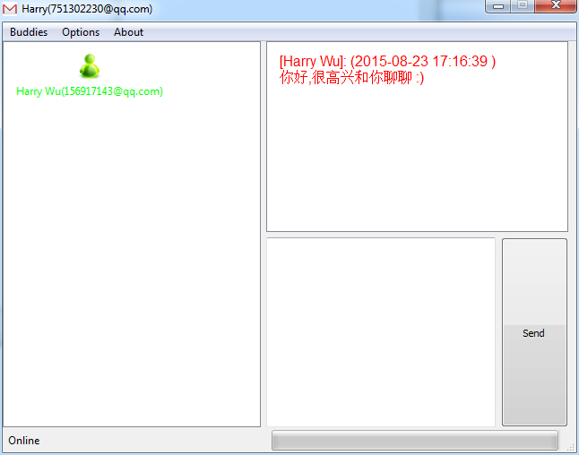 

- Encrypted messages on mail servers. 

- 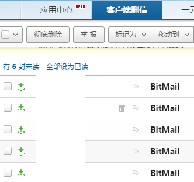 

- Encrypted message body. 

- 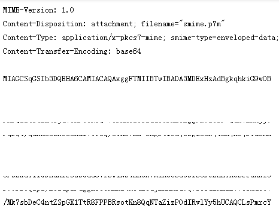 

- Scan qrcode and begin talking with author's bitmail. 
- BitMail://751302230@qq.com#SHA1:94F2C52CFB1BDCED0CB0C06C7D74767A778FFCD3
- 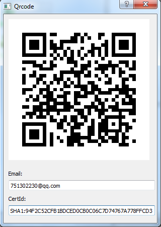 

- Daemon mode, a little like public account of wechat.
- BitmailClient --recvmsg -B ... ...
- 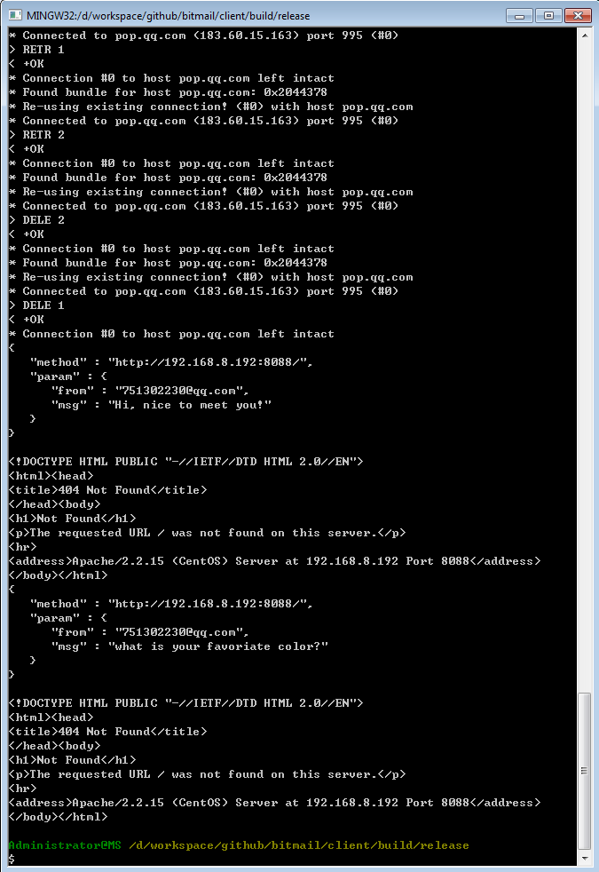

- reply with command line tool.
- BitmailClient --sendmsg -b ... ...
- 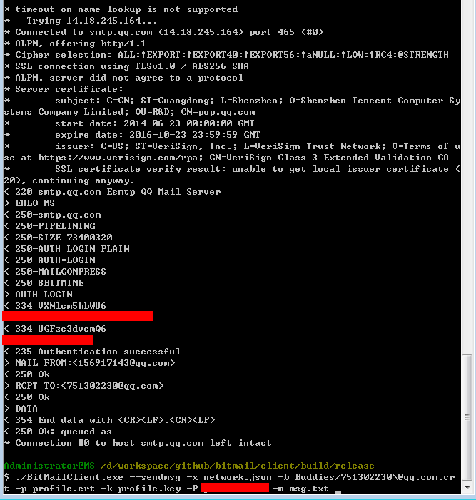

###TODO
- web frontend GUI,
- Mobile app.
                           

### Welcome to contribute
- Anyone with Qt, web, mobile, or secure network programming knowledge is welcome.
                           
